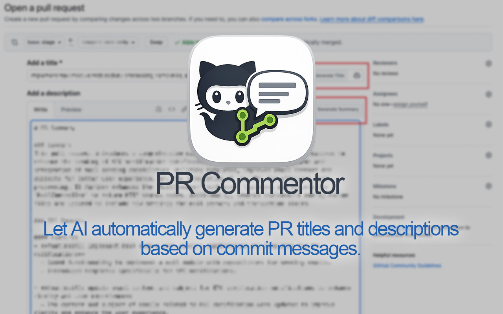
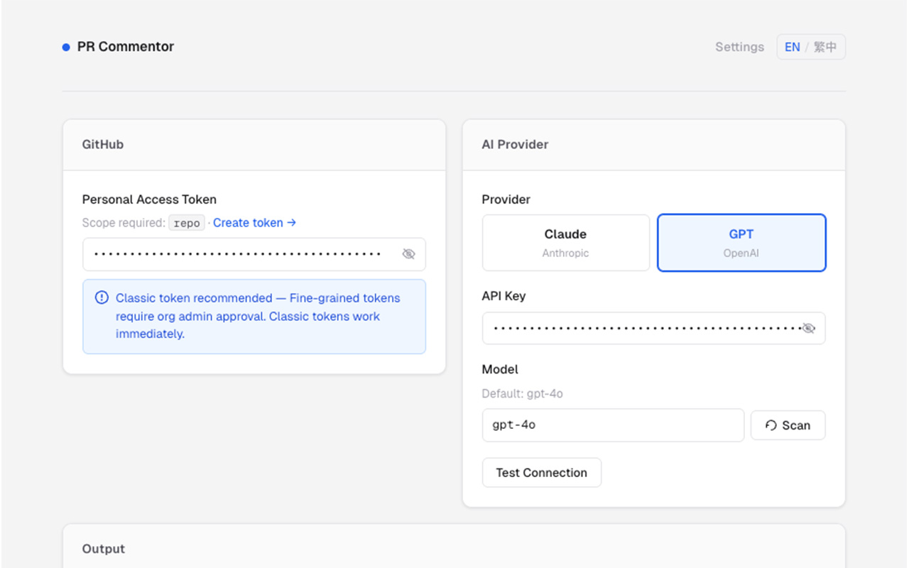
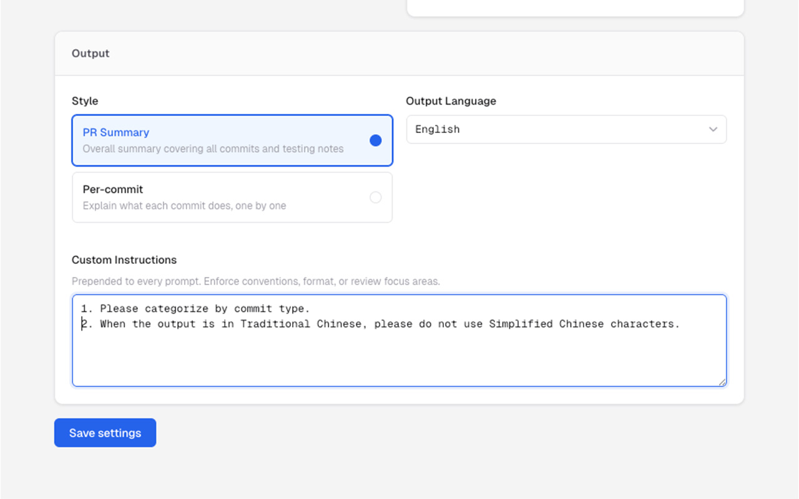
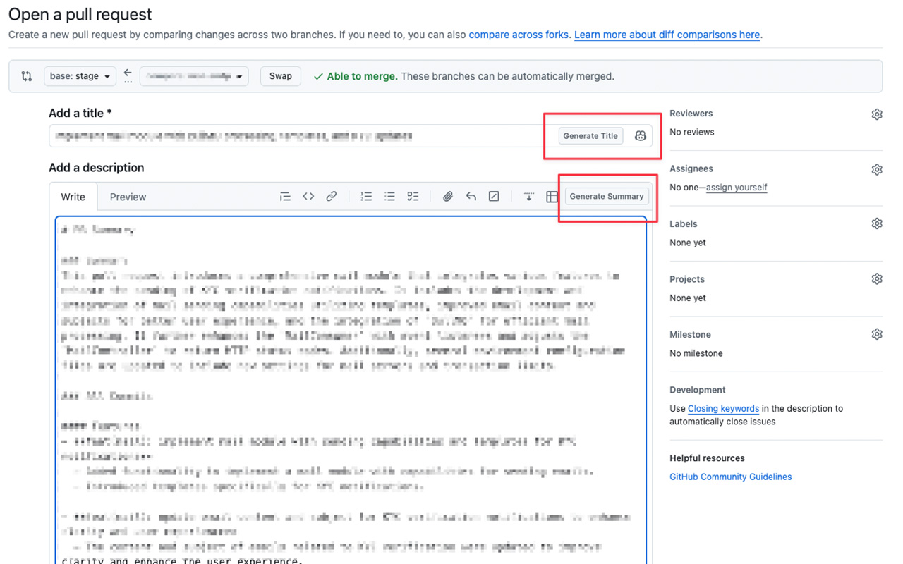

# PR Commentor

[繁體中文](./documents/README.zh-TW.md) | English

> AI-powered PR summaries and titles, generated directly inside GitHub — no copy-pasting required.



PR Commentor injects a **Generate Summary** button into every GitHub pull request comment box and a **Generate Title** button next to the PR title field. One click fetches the full diff and commit history from the GitHub API, sends it to your chosen AI model, and inserts the result straight into the text area — ready to submit.

---

## Chrome Web Store

### Detailed Description

**PR Commentor** adds AI-powered "Generate Summary" and "Generate Title" buttons directly into the GitHub pull request UI. Stop writing PR descriptions from scratch — let the AI analyze your commits and diffs and do the first draft for you.

**How it works**

1. Open any GitHub pull request (or the compare page before opening a PR).
2. Click **Generate Summary** in the comment toolbar — the extension fetches the PR metadata, all commits, and the full diff from the GitHub API, then sends it to your AI provider.
3. The generated summary is inserted into the comment box immediately. Edit and submit.
4. Click **Generate Title** next to the PR title field to get a concise, imperative-mood title (≤ 72 characters) based on the same data.

**Features**

- **Two AI providers** — choose between Claude (Anthropic) and GPT (OpenAI). Bring your own API key; nothing is stored outside your browser.
- **Two output styles** — *PR Summary* produces an overall summary with a description, commit list, and testing notes. *Per-commit* explains each commit individually, one by one.
- **Output language** — English or 繁體中文 (Traditional Chinese). Switch at any time in Settings.
- **Custom instructions** — prepend your own instructions to every prompt (e.g. "Always flag missing tests. Focus on security implications.") to enforce team conventions.
- **Model selection with Scan** — type any model name or hit Scan to auto-discover available models from the selected provider's API.
- **Connection test** — verify your API key and model work before you need them.
- **Private repo support** — works with both public and private repositories when your GitHub token has the required scopes.
- **Dark mode ready** — uses GitHub's native CSS custom properties; looks correct in all themes.
- **GitHub SPA navigation** — stays active as you navigate between PRs without refreshing the page.

**Permissions used**

- `storage` — saves your settings (tokens, API keys, preferences) locally in your browser via `chrome.storage.sync`. Nothing is sent to any server other than the GitHub and AI provider APIs you configure.
- `activeTab` — reads the current GitHub PR URL to extract owner, repo, and PR number.
- Host permissions for `api.github.com`, `api.anthropic.com`, and `api.openai.com` — required to fetch PR data and call the AI APIs directly from the extension.

**Privacy**

Your GitHub token and AI API key are stored only in Chrome's encrypted sync storage and are sent only to their respective services (GitHub and your chosen AI provider). PR Commentor does not collect, transmit, or log any data.

---

## Features

| Feature | Detail |
|---|---|
| Generate Summary | Inserts a full PR summary (overview + commits + testing notes) into any comment box |
| Generate Title | Suggests a concise PR title (≤ 72 chars, imperative mood) next to the title field |
| AI Providers | Claude (`claude-sonnet-4-6`) · GPT (`gpt-4o`) — fully configurable |
| Output Style | **PR Summary** (overall) or **Per-commit** (explain each commit individually) |
| Output Language | English · 繁體中文 |
| Custom Instructions | Prefix prompt injected before every AI call |
| Model Scan | Auto-fetches available models from Anthropic / OpenAI API |
| Connection Test | One-click API key + model validation |
| Private Repos | Supported with a GitHub token with `repo` scope |
| SPA Navigation | Works across GitHub's Turbo/SPA navigation |
| Dark Mode | Uses GitHub CSS variables — adapts to all themes automatically |

---

## Installation

### From Chrome Web Store *(recommended)*

Search for **PR Commentor** in the [Chrome Web Store](https://chromewebstore.google.com) and click **Add to Chrome**.
Direct install link: [PR Commentor on Chrome Web Store](https://chromewebstore.google.com/detail/pr-commentor/oeeinalbokfbkelchgmkpabjohggnppl).

### Manual (unpacked)

```bash
git clone https://github.com/your-username/pr-commentor.git
cd pr-commentor
npm install
npm run build
```

1. Open `chrome://extensions`
2. Enable **Developer mode** (top-right toggle)
3. Click **Load unpacked** → select the `dist/` folder

---

## Setup

The settings page opens automatically on first install. You can reopen it anytime by clicking the extension icon.



### 1. GitHub Personal Access Token

Required to read PR data via the GitHub API.

- Go to **GitHub → Settings → Developer settings → Personal access tokens → Classic**
- Create a token with the **`repo`** scope (needed for private repos; `public_repo` is sufficient for public-only)
- Paste the token (`ghp_…`) into the **GitHub Token** field

> **Fine-grained tokens** require organization admin approval before they work on org repositories. Classic tokens are recommended.

### 2. AI Provider & API Key

Choose **Claude** or **GPT**, then paste the corresponding API key:

| Provider | Where to get a key |
|---|---|
| Claude (Anthropic) | [console.anthropic.com](https://console.anthropic.com) |
| GPT (OpenAI) | [platform.openai.com](https://platform.openai.com) |

Click **Scan** to auto-populate available models, or type a model name directly.
Click **Test Connection** to confirm everything is working.

### 3. Output Preferences



| Setting | Options |
|---|---|
| Style | PR Summary · Per-commit |
| Language | English · 繁體中文 |
| Custom Instructions | Free-text, prepended to every prompt |

Click **Save settings** when done.

---

## Usage



### Generate a PR Summary

1. Open a GitHub pull request.
2. Click anywhere in the comment box (PR description or any comment).
3. Click the **Generate Summary** button that appears in the comment toolbar.
4. Wait a few seconds — the AI-generated summary is inserted into the box.
5. Edit as needed and submit.

Works on PR pages (`/pull/*`) and on compare pages (`/compare/*`) before a PR is opened.

### Generate a PR Title

1. Open a GitHub PR or compare page.
2. Click **Generate Title** next to the PR title field.
3. The AI suggests a concise, imperative-mood title based on commits and changed files.

---

## Development

```bash
npm install          # Install dependencies
npm run dev          # Vite dev build with watch
npm run build        # Production build → dist/
npm run zip          # Build + package dist/ into build/pr-commentor-x.x.x.zip
npm run zip:only     # Package dist/ only (skip rebuild)
```

**Stack:** TypeScript · Vite · `@crxjs/vite-plugin` · Manifest V3

---

## Privacy & Security

- All tokens and API keys are stored in **`chrome.storage.sync`** (encrypted, synced to your signed-in Chrome profile) and are never sent anywhere except GitHub and your AI provider.
- PR Commentor does not include any analytics, telemetry, or third-party tracking.
- The extension only activates on `github.com/*/pull/*` and `github.com/*/compare/*` URLs.

---

## License

MIT
